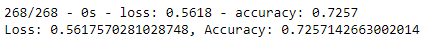
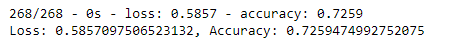
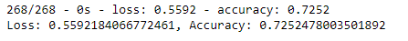
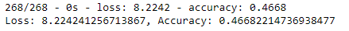

# Neural Network Charity Analysis

## Overview of the Analysis 
To create a binary classifier capable of predicting if applicants will be successfully funded by Alphabet Soup based on a dataset of 34,000 organizations that previously received funds. 

## Resources 
* Dataset: [charity_data.csv](Resources/charity_data.csv)
* Challenge Code: [AlphabetSoupCharity.ipynb](AlphabetSoupCharity.ipynb) 
  * [AlphabetSoupCharity.h5](AlphabetSoupCharity.h5)
* Optimization Code: [AlphabetSoupCharity_Optimization.ipynb](AlphabetSoupCharity_Optimization.ipynb)
  * [AlphabetSoupCharity_optimzation.h5](AlphabetSoupCharity_optimzation.h5)

## Results 

### Data Preprocessing 
* The target variable for the model was the "IS_SUCCESSFUL" column. 
* The varibales considered to be the features include all columns except for the "IS_SUCCESSFUL" column and those dropped to account for less noise. 
* The variables that were neither targets nor features include: "EIN" and "NAME"

## Compiling, Training, and Evaluating the Model 
* Hidden Layers: 2
* Neurons: 80 (First layer), 30 (Second layer)
* Activation functions: ReLu for the hidden layers and Sigmoid for the output
* Compilation - optimizer used was adam, loss function was binary_crossentropy.

* The target model performance goal of 75% was no achieved. Based on the optimization attempts, it either remained the same at approximately 73% or decreased. 

Original Analysis:

Attempt #1 
*  Noisy features were removed. Additional neurons were added to hidden layers and the model's weights was saved every 5 epochs. 

Attempt #2 
* A third hidden layer was added with 10 neurons. 

Attempt #3
* The activation functions were changed. For hidden layers, the function was changed from relu to sigmoid and for the output, it was changed from sigmoid to relu. 

## Summary 
In conclusion, the model is moderately accurate, however it should still be optimized to reach the goal of 75% accuracy. This can be done by attempting a different type of kind of model and by changing the parameters. The Random Forest model could be used to compare with our results from a neural network and determine if the accuracy increases. Random Forest would also confirm if this analysis was subjected to overfitting. Random Forest is also robust against outliers and nonlinear regression, making it a favourable next step for this analysis process. 
